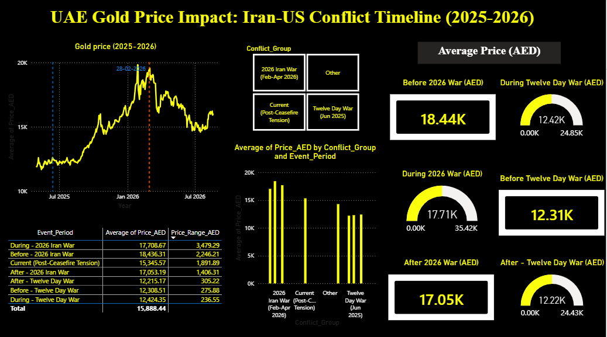

# UAE Gold Price Impact: Iran-US Conflict Timeline (2025–2026)

## 📌 Overview
An interactive Power BI dashboard analyzing how UAE gold prices (AED) responded to two 
major Iran-US conflict escalations: the June 2025 Twelve-Day War and the ongoing 
2026 Iran War, using daily XAU/USD historical data converted to AED.

## ❓ Business Question
How have gold prices in the UAE market moved before, during, and after major regional 
conflict escalations, and how does market volatility compare between the two events?

## 📊 Dataset
- **Source:** [Investing.com - XAU/USD Historical Data](https://www.investing.com/currencies/xau-usd-historical-data)
- **Range:** May 2025 - August 2026 (daily)
- **Fields:** Date, Price, Open, High, Low, Volume, Change %
- **Conversion:** USD prices converted to AED using the fixed peg rate (1 USD = 3.6725 AED)

## 🛠️ Tools Used
Power BI (Power Query, DAX, Data Modeling, Custom Measures)

## 🔍 Approach
1. Imported and cleaned daily gold price data, resolving date format inconsistencies
2. Converted USD prices to AED using the fixed currency peg
3. Built a custom Event_Period column labeling each date relative to two conflict windows
4. Created 7 KPI cards comparing average price before/during/after each conflict
5. Built a daily price trend line with constant-line markers at each conflict's start date
6. Built comparison bar charts across all periods and grouped by conflict
7. Wrote a custom DAX measure to calculate price volatility (range) within each period
8. Added a summary table combining average price and volatility side by side

## 💡 Key Insights
- The Twelve-Day War (June 2025) saw only a modest price shift: 12.31K → 12.42K AED, 
  with relatively low volatility (~236-305 AED range)
- The 2026 Iran War saw average price *decline* slightly during the conflict 
  (18.44K → 17.71K AED), but with dramatically higher volatility (~3,479 AED range) — 
  roughly 10x more volatile than the 2025 event
- Gold remains elevated in the post-ceasefire period, reflecting ongoing market caution 
  amid unresolved tensions over the Strait of Hormuz and stalled negotiations

## 📷 Dashboard Preview

## 👤 About
Built by Deepthi R.S. — Data Analyst | SQL, Power BI, Excel, Tableau  
[LinkedIn](https://www.linkedin.com/in/deepthi1227) 
